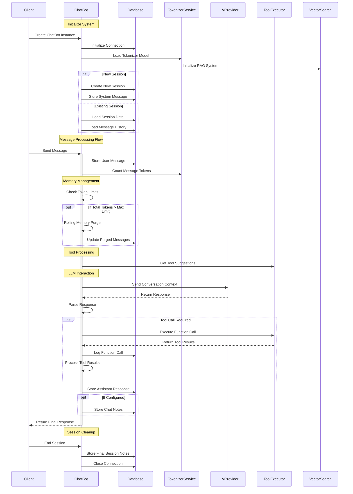

Intro
---
Using this as a practice for making agents and deploying them on discord as testing grounds.

Right now the backend is a vllm openai inference server. SGlang has been tested but they dont have tool support yet so sticking with vllm


Current Arch
---


## Diagram Overview

The sequence diagram above illustrates the main components and flows of the chatbot system:

1. **Initialization Phase**
   - System initialization and connection setup
   - Session handling (new/existing)

2. **Message Processing Flow**
   - User message handling
   - Token management
   - Memory management with rolling purge

3. **Core Processing Loop**
   - Tool suggestion gathering
   - LLM interaction
   - Tool execution pathway
   - Database logging

4. **Response Handling**
   - Response type processing
   - Tool call execution
   - Response storage

5. **Session Management**
   - Session cleanup
   - Final notes storage
   - Connection cleanup

Notes
---
- I see that for time and time conversions its not able to calculate given that it has the correct time given to it at all times. Need some fn calling implementations.
- It has a very reddit flavored speech antics. system prompt might need tweaking, need to instruct to be authentic and not a yes man always while still being helpful
- How can I get it to remember its system prompt but not talk about it too much or in conversations
- need instruction to not hallucinate any tools, and be transparent to user if its not able to accomplish the task
- add a tool maker, where its able to generate tools (thats a little out of scope bc of its complixity for now)
- need to add examples of when to use <self_response>, <user_response>, and <plan>
- what to do with <thoughts>, its helpful for it to analyze before outputting a response but after do we just discard?
- some <self_response> might just be a little note the LLM is keeping for itself, this should be allowed and handled. maybe we need to show examples of this for it to behave correctly here.
- omitting tags out of the messages list is bad because it starts following how previous messages of the convo, which if we remove the tags we include in the guideline it will confuse it. hmmmm what to do? 
    - SOLUTION: decided to keep the <thought> tags and one of the 4 response tags that it replies with per turn
- i think im only logging successful fn/tool calls. need to inspect logging a bit closer.
    - wasn't logging the <tool_call> only the responses, now added that so its a chain of `<user> -> <tool_call> -> <tool_call_response>`
- multi tool call works and chained tool calling seems to work as well. need to do an eval on this

thoughts on tools
---
- How to enable using a large set of tools?
- tool chaining and mixing by including tools and their code as rag inputs and have the llm craft a function that uses the tools and execute it in the python interpreter to achieve its goal
- browser access and web browsing capable tool/agent is needed maybe even necessary. maybe use open-interpreter and slowly build my own?
- how to give access to personals (gmail, messages, social_media) for monitoring as a personal assistant
- need to use the screenshot tool and chain it with VLMs to have it understand what the user is seeing
- how to enable uploading of files to discuss about and feed it into the LLM.
- arxiv and stuff needs more options like, search for list of paper titles only or hand back x results instead of being limited by char_length.
- need to meter the API calls and how many made so we try to not blow it up. can even be fed back into it for better sense of resource usage
- if i want it to take a screenshot with screenshot tool then pass it into the query_vlm tool, how would i do that? currently the outputs are all posted as <tool_call_response> as string. how can i share arbritary objects as well?
- user message can have link to explore, need to include examples of that too
- TODO: insert tools into every python interpreter so they can combine and chain the tools as the agents see fit. Also add examples of this demonstrated in the system prompt
- Add in the message eb entry a column for "sent_to_viewer" to make sure we track which of the generated message actually made it ot the viewer. sometimes the api of the messaging platform or UI might not be responsive or fail at the sending stage.
- reminder tools and other similar ones for day to day use
- airport flight tracker given a flight number, save it to a person or not (sam's flight is AM234 or track flight AM345)
- rag based context retrival: should this be a tool or a more deeply integrated thing


active learning
---
- how can the agent learn from interacting(chatting/tool use) with its environment?
- RAG storage is probably the only way for now. other wayt involves thinking about active training and synthetic data generation so that seems too complicated for now.
- need to be able to mark past content in the current message tree as needed or not needed so we can later trim it smartly (we can trim the cat outputs of large programs or logfiles because we probably only needed small piece of info for it or have summarized the key info into a succint text that we dont need the original anymore to add noise.)

misc
---
- small llm that just adds docstrings to a repo passively as it observes new edits in the repo its activated in
- vllm openAI endpoints
    - `/openapi.json`, Methods: GET, HEAD
    - `/docs`, Methods: GET, HEAD
    - `/docs/oauth2-redirect`, Methods: GET, HEAD
    - `/redoc`, Methods: GET, HEAD
    - `/health`, Methods: GET
    - `/tokenize`, Methods: POST
    - `/detokenize`, Methods: POST
    - `/v1/models`, Methods: GET
    - `/version`, Methods: GET
    - `/v1/chat/completions`, Methods: POST
    - `/v1/completions`, Methods: POST
    - `/v1/embeddings`, Methods: POST

clean install
---
```bash
\# install uv
apt update
apt install -y postgresql
apt install -y poppler-utils libpq-dev python3.11-dev

curl -LsSf https://astral.sh/uv/install.sh | sh
source $HOME/.cargo/env
uv python install 3.11

git clone https://github.com/SulavKhadka/llm_chatbot.git
cd llm_chatbot

uv venv --python=3.11
source .venv/bin/activate

uv pip install python-telegram-bot discord.py transformers pydantic openai loguru logfire llama-index geopy huggingface-hub mss langchain ipykernel ipywidgets nvitop torchvision pdf2image qwen-vl-utils torch psutil psycopg2 psycopg2-binary langchain-community "wikibase-rest-api-client<0.2" mediawikiapi arxiv

uv pip install -U pip
python -m pip install flash-attn --no-build-isolation


\# To add $HOME/.cargo/bin to your PATH
```

To-Do
---
[x] Add to system prompt some realtime details to give the chatbot some grounding and info: DateTime
[ ] give it access to inject files and use them in the chat as context, so basically RAG but more realtime i guess
 